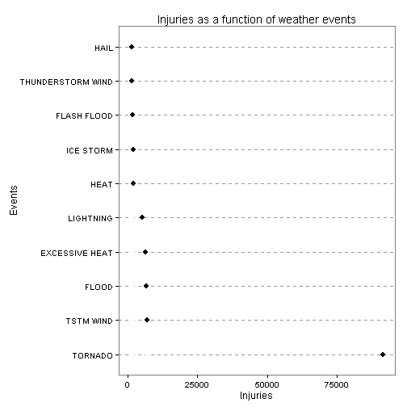

Reproducible Research: Peer Assessment 2 - Impact of Storm and Weather events on public health and economy
========================================================


# Synopsis

In this report we try to elicit the damages caused by various severe weather events in the USA. We focus on human life loss and economic consequences. The obtained results suggest that tornados cause the most damage on population health and floods on economy.

* Step 1: Load the data
* Step 2: Process the data
* Step 3: Create the plots for human life consequences
* Step 4: Create the plot for economic consequences

## Loading and preprocessing the data


```r
if (!file.exists("repdata_data_StormData.csv")) {
    unzip(zipfile="repdata_data_StormData.csv.bz2")
}
data <- read.csv("repdata_data_StormData.csv")
```

# Data Processing
## Keep the rows of interest


```r
reducedData <- data[,c('EVTYPE','FATALITIES','INJURIES', 'PROPDMG', 'PROPDMGEXP', 'CROPDMG', 'CROPDMGEXP')]
```

## Multiply the damage variables by their respective magnitude


```r
## Property Damage 
reducedData$PROPDMGNUM = 0
reducedData[reducedData$PROPDMGEXP == "H", ]$PROPDMGNUM = reducedData[reducedData$PROPDMGEXP == "H", ]$PROPDMG * 1e+02
reducedData[reducedData$PROPDMGEXP == "K", ]$PROPDMGNUM = reducedData[reducedData$PROPDMGEXP == "K", ]$PROPDMG * 1e+03
reducedData[reducedData$PROPDMGEXP == "M", ]$PROPDMGNUM = reducedData[reducedData$PROPDMGEXP == "M", ]$PROPDMG * 1e+06
reducedData[reducedData$PROPDMGEXP == "B", ]$PROPDMGNUM = reducedData[reducedData$PROPDMGEXP == "B", ]$PROPDMG * 1e+09

## Crop damage
reducedData$CROPDMGNUM = 0
reducedData[reducedData$CROPDMGEXP == "H", ]$CROPDMGNUM = reducedData[reducedData$CROPDMGEXP == "H", ]$CROPDMG * 1e+02
reducedData[reducedData$CROPDMGEXP == "K", ]$CROPDMGNUM = reducedData[reducedData$CROPDMGEXP == "K", ]$CROPDMG * 1e+03
reducedData[reducedData$CROPDMGEXP == "M", ]$CROPDMGNUM = reducedData[reducedData$CROPDMGEXP == "M", ]$CROPDMG * 1e+06
reducedData[reducedData$CROPDMGEXP == "B", ]$CROPDMGNUM = reducedData[reducedData$CROPDMGEXP == "B", ]$CROPDMG * 1e+09
```

# Results

1) Across the United States, which types of events (as indicated in the EVTYPE variable) are most harmful with respect to population health?


```r
# Fatalities for each event
fatalities <- aggregate(FATALITIES ~ EVTYPE, data=reducedData, sum)
fatalities <- fatalities[order(-fatalities$FATALITIES), ][1:10, ]
fatalities$EVTYPE <- factor(fatalities$EVTYPE, levels = fatalities$EVTYPE)

library(ggplot2)
# Fatality consequences plot
ggplot(fatalities, aes(x = FATALITIES, y = EVTYPE)) +
    geom_segment(aes(xend=FATALITIES), yend=0, colour="grey100") +
    geom_point(size=3) +
    ggtitle("Human fatalities as a function of weather events") +
    labs(x="Fatalities", y="Events") +
    theme_bw() +
    theme(panel.grid.major.x = element_blank(),
              panel.grid.minor.x = element_blank(),
              panel.grid.major.y = element_line(colour="grey60", linetype="dashed"))
```

 


```r
# Injuries for each weather event
injuries <- aggregate(INJURIES ~ EVTYPE, data=reducedData, sum)
injuries <- injuries[order(-injuries$INJURIES), ][1:10, ]
injuries$EVTYPE <- factor(injuries$EVTYPE, levels = injuries$EVTYPE)

library(ggplot2)
# Injury consequences plot
ggplot(injuries, aes(x = INJURIES, y = EVTYPE)) +
    geom_segment(aes(xend=INJURIES), yend=0, colour="grey100") +
    geom_point(size=3) +
    ggtitle("Injuries as a function of weather events") +
    labs(x="Injuries", y="Events") +
    theme_bw() +
    theme(panel.grid.major.x = element_blank(),
              panel.grid.minor.x = element_blank(),
              panel.grid.major.y = element_line(colour="grey60", linetype="dashed"))
```

 

## Response: Tornado

##  2)  Across the United States, which types of events have the greatest economic consequences?


```r
# Damages for each weather event
damages <- aggregate(PROPDMGNUM + CROPDMGNUM ~ EVTYPE, data=reducedData, sum)
names(damages) = c("EVTYPE", "TOTALDAMAGE")
damages <- damages[order(-damages$TOTALDAMAGE), ][1:10, ]
damages$EVTYPE <- factor(damages$EVTYPE, levels = damages$EVTYPE)

library(ggplot2)
# Economic consequences plot
ggplot(damages, aes(x = TOTALDAMAGE, y = EVTYPE)) +
    geom_segment(aes(xend=TOTALDAMAGE), yend=0, colour="grey100") +
    geom_point(size=3) +
    ggtitle("Economic damages as a function of weather events") +
    labs(x="US $", y="Events") +
    theme_bw() +
    theme(panel.grid.major.x = element_blank(),
              panel.grid.minor.x = element_blank(),
              panel.grid.major.y = element_line(colour="grey60", linetype="dashed"))
```

 

## Response: Flood
